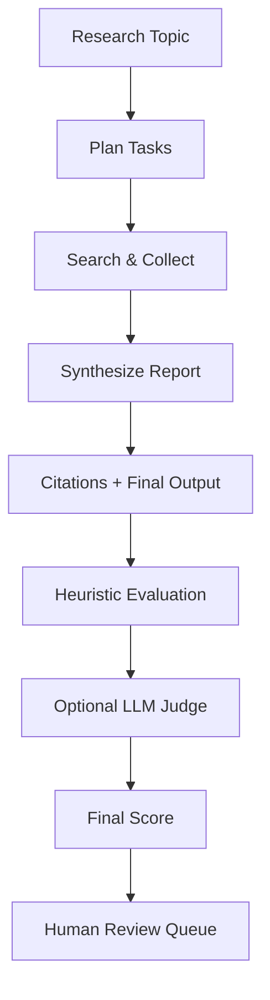

# Deep Research Agent

一个可落地的 AI 研究助手项目：从问题拆解、搜索检索、证据追踪到报告生成，并内置可持续演进的 benchmark / LLM Judge / 人工复核流程。

## Why This Project

- 面向真实场景：不是单轮问答，而是完整 research workflow。
- 面向工程质量：支持自动评测、低成本 LLM Judge、人工复核闭环。
- 面向面试展示：结构清晰、可复现实验、可解释指标。

## Core Features

- `Research Agent Pipeline`
  - 自动研究规划（3-5 子任务）
  - 搜索与信息收集
  - 引用追踪与报告生成
- `Multi-LLM Compatible`
  - OpenAI 兼容接口
  - Minimax（`minimax-m2.1`）
- `Evaluation First`
  - 启发式评测（关键词/结构/引用/任务数/长度）
  - LLM-as-a-Judge（可控触发，默认低资源）
  - 人工复核队列与评分表自动生成

## Project Structure

```text
.
├── research_agent.py          # 核心 LangGraph workflow
├── app.py                     # Streamlit UI
├── enhanced_search.py         # Tavily / DuckDuckGo 搜索适配
├── run_benchmark.py           # benchmark 入口
├── benchmark/
│   ├── dataset.py             # 数据集定义与加载
│   ├── scoring.py             # 启发式评分
│   ├── judge.py               # LLM Judge
│   ├── human_review.py        # 人工复核队列
│   ├── human_review_merge.py  # 人工评分回填
│   └── runner.py              # 评测编排
├── benchmark_datasets/
│   └── research_questions_zh_v1.jsonl
├── BENCHMARK.md
└── MINIMAX_SETUP.md
```

## Architecture



## Quick Start

### 1. Install

```bash
python -m venv venv
source venv/bin/activate
pip install -r requirements.txt
```

### 2. Configure Env

```bash
cp .env.example .env
```

仅在 `.env` 中填写你自己的密钥，**不要提交到 Git**。

### 3. Run Agent (CLI)

```bash
python research_agent.py "LangGraph 在多智能体系统中的应用"
```

### 4. Run Web UI

```bash
streamlit run app.py
```

### 5. Run Benchmark

低成本联调：

```bash
python run_benchmark.py --dry-run --limit 5
```

真实评测（低成本 LLM Judge 推荐配置）：

```bash
python run_benchmark.py \
  --model minimax-m2.1 \
  --base-url https://api.minimax.chat/v1 \
  --llm-judge-mode low_score \
  --llm-judge-max-cases 3 \
  --llm-judge-threshold 0.65 \
  --llm-judge-weight 0.2
```

## Evaluation Design (Interview-Friendly)

- `heuristic_score`: 低成本、稳定、可解释
- `llm_judge_score`: 语义质量补充（抽样或低分触发）
- `final_score`: 融合后用于横向比较
- 输出物：
  - `summary.json`
  - `case_scores.jsonl`
  - `raw_outputs.jsonl`
  - `human_review_queue.jsonl`
  - `human_review_form.md`

## Security & Privacy

- 项目中不包含任何个人 API Key。
- 所有密钥均通过环境变量注入（`.env` 本地使用）。
- `.gitignore` 已默认忽略：`.env`、`benchmark_results/`、`__pycache__/`。

## For Recruiters

这个项目可直接体现以下能力：

- Agent workflow 设计（LangGraph 状态机）
- LLM 工程化（多模型适配、参数化、失败回退）
- 评测体系设计（自动化 + LLM Judge + 人工复核）
- 成本与效果平衡（触发策略、抽样评审、短上下文 Judge）

## Roadmap

- 增加事实核验（claim-level verification）
- 增加英文与双语 benchmark
- 增加可视化评测看板
- 增加在线 A/B 评测与回归告警

## Links

- GitHub: [AndleCandy/deep-research-agent](https://github.com/AndleCandy/deep-research-agent)
- Benchmark Guide: [BENCHMARK.md](./BENCHMARK.md)
- Minimax Setup: [MINIMAX_SETUP.md](./MINIMAX_SETUP.md)
